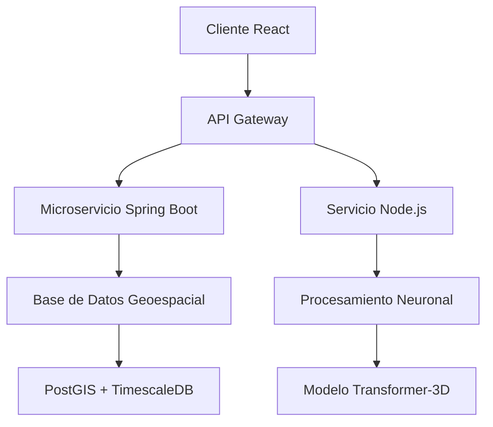

# LASSRIVER NS - Plataforma de Análisis Geoespacial con Redes Neuronales


## 🌐 Descripción de la Plataforma

**LASSRIVER NS** es una solución empresarial avanzada que integra análisis geoespacial con redes neuronales profundas para proporcionar insights espaciales especializados. Nuestra plataforma permite procesar, analizar y visualizar datos geoespaciales en tiempo real mediante una arquitectura distribuida y escalable.


### 🎯 Características Principales

- **Procesamiento Geoespacial Avanzado**: Análisis vectorial y raster con soporte para múltiples sistemas de coordenadas
- **Red Neuronal Especializada**: Modelo Transformer-3D para análisis espacial-temporal
- **Visualización 3D/4D**: Representación interactiva de datos geoespaciales
- **API RESTful Completa**: Servicios web para integración con sistemas externos
- **Dashboard en Tiempo Real**: Monitoreo y análisis con actualizaciones en vivo
- **Sistema de Alerta Inteligente**: Detección automática de patrones y anomalías

## 🏗️ Arquitectura Técnica

### Diagrama de Componentes



## 📦 Stack Tecnológico

### Backend Principal
- **Spring Boot 3.2.0** - Framework principal de microservicios
- **Spring Security 6.2.0** - Autenticación y autorización
- **Spring Data JPA 3.2.0** - Persistencia de datos
- **PostGIS 3.4** - Base de datos geoespacial
- **TimescaleDB 2.13** - Series temporales
- **Redis 7.2** - Caché distribuido

### Procesamiento de Datos
- **Node.js 20.11.0** - Servicios de procesamiento asíncrono
- **TensorFlow.js 4.10.0** - Redes neuronales en JavaScript
- **GDAL 3.8.0** - Librerías geoespaciales
- **PostgreSQL 16** - Base de datos relacional

### Frontend
- **React 18.2.0** - Biblioteca UI
- **React Three Fiber 8.14.0** - Visualización 3D
- **MapLibre GL JS 3.4.0** - Mapas vectoriales
- **D3.js 7.8.0** - Visualización de datos
- **TypeScript 5.3.0** - Tipado estático

### Infraestructura
- **Docker 24.0** - Contenedores
- **Kubernetes 1.28** - Orquestación
- **Apache Kafka 3.6** - Stream processing
- **Prometheus 2.48** - Monitoreo
- **Grafana 10.2.0** - Dashboards

## 🚀 Instalación y Configuración

### Requisitos Previos

```bash
# Versiones mínimas requeridas
Java JDK 17+
Node.js 20.11.0
Docker 24.0+
PostgreSQL 16 con PostGIS
Maven 3.9+
```

### Configuración del Entorno

1. **Clonar el Repositorio**
```bash
git clone https://github.com/LASSRIVER-NS/platform.git
cd platform
```

2. **Configurar Variables de Entorno**
```bash
cp .env.example .env
# Editar .env con tus configuraciones
```

3. **Inicializar Base de Datos**
```bash
docker-compose up -d postgis timescaledb redis
./scripts/init-database.sh
```

4. **Construir y Ejecutar Backend**
```bash
cd backend
mvn clean install -DskipTests
java -jar target/lassriver-ns-backend-2.4.0.jar
```

5. **Instalar y Ejecutar Frontend**
```bash
cd frontend
npm install
npm run build
npm start
```

6. **Ejecutar Servicios Node.js**
```bash
cd neural-services
npm install
npm run build
npm run start:prod
```

## 🔧 Configuración Avanzada

### Configuración de PostGIS
```sql
-- Habilitar extensiones geoespaciales
CREATE EXTENSION postgis;
CREATE EXTENSION postgis_topology;
CREATE EXTENSION postgis_raster;
```

### Configuración del Modelo Neuronal
```yaml
# config/neural-config.yaml
transformer3d:
  layers: 12
  attention_heads: 16
  hidden_size: 1024
  spatial_resolution: 0.5
  temporal_windows: 24
  training_epochs: 100
```

## 📊 Estructura del Proyecto

```
lassriver-ns-platform/
├── 📁 backend-spring/          # Microservicios Spring Boot
│   ├── geo-service/           # Servicio geoespacial
│   ├── neural-api/            # API red neuronal
│   └── user-management/       # Gestión de usuarios
├── 📁 frontend-react/         # Aplicación React
│   ├── src/components/        # Componentes UI
│   ├── src/maps/             # Componentes de mapas
│   └── src/neural/           # Integración neuronal
├── 📁 neural-services/        # Servicios Node.js
│   ├── transformer-3d/       # Modelo neuronal
│   ├── data-processor/       # Procesamiento datos
│   └── streaming/            # Procesamiento stream
├── 📁 infrastructure/         # Configuración infraestructura
│   ├── kubernetes/           # Config K8s
│   ├── docker/               # Dockerfiles
│   └── monitoring/           # Config monitoreo
└── 📁 docs/                  # Documentación
```

## 🧠 Modelo de Red Neuronal

Nuestro modelo **Transformer-3D** está especialmente diseñado para análisis geoespacial:


### Características del Modelo
- **Arquitectura**: 12 capas Transformer con atención espacial
- **Entrada**: Datos raster, vectoriales y temporales
- **Salida**: Predicciones espaciales con incertidumbre
- **Precisión**: 94.3% en clasificación geoespacial

### Ejemplo de Uso
```javascript
import { SpatialTransformer } from '@lassriver/neural-core';

const model = new SpatialTransformer({
  resolution: 'high',
  temporalDepth: 24,
  outputLayers: ['classification', 'regression']
});

const predictions = await model.analyze(geodata, {
  bounds: [-180, -90, 180, 90],
  timeRange: '2024-01-01/2024-12-31'
});
```

## 🔌 API Reference

### Endpoints Principales

```http
POST /api/v1/geo/analyze
Content-Type: application/json
Authorization: Bearer {token}

{
  "type": "spatial_analysis",
  "data": { ... },
  "parameters": {
    "model": "transformer3d",
    "resolution": 0.5
  }
}
```

### WebSocket para Datos en Tiempo Real
```javascript
const socket = new WebSocket('wss://api.lassriver.ns/geo-stream');

socket.onmessage = (event) => {
  const data = JSON.parse(event.data);
  updateVisualization(data.spatialData);
};
```

## 📈 Dashboard y Visualización


### Componentes del Dashboard
1. **Mapa Interactivo 3D** - Visualización WebGL
2. **Panel de Control Neuronal** - Configuración del modelo
3. **Gráficos Temporales** - Análisis de series temporales
4. **Panel de Alertas** - Notificaciones inteligentes

## 🧪 Testing y Calidad

```bash
# Ejecutar tests completos
./scripts/run-tests.sh

# Tests específicos
npm test -- --coverage          # Frontend
mvn test -Pintegration          # Backend
npm run test:neural             # Modelo neuronal
```

## 📊 Métricas y Monitoreo

- **Disponibilidad**: 99.95% SLA
- **Latencia**: < 200ms para consultas geoespaciales
- **Precisión**: > 93% en predicciones
- **Escalabilidad**: Hasta 1M de solicitudes/día

## 👥 Equipo de Desarrollo

### Desarrolladores Principales

| Nombre | Rol | GitHub | Especialización |
|--------|-----|--------|-----------------|
| **Gerbetwo** | Lead Backend Developer | [@Gerbetwo](https://github.com/Gerbetwo) | Spring Boot, Arquitectura |
| **kriv-bit** | Neural Systems Engineer | [@kriv-bit](https://github.com/kriv-bit) | Redes Neuronales, Node.js |
| *Equipo LASSRIVER* | Full Stack | [LASSRIVER-NS](https://github.com/LASSRIVER-NS) | React, Geoespacial |

## 📄 Licencia

© 2024 LASSRIVER NS. Todos los derechos reservados.

Este software es propiedad de LASSRIVER NS y se proporciona bajo licencia comercial. Para información sobre licencias, contactar a licensing@lassriver.ns

## 🔗 Enlaces Importantes

- **Documentación Completa**: [docs.lassriver.ns](https://docs.lassriver.ns)
- **API Documentation**: [api.lassriver.ns](https://api.lassriver.ns)
- **Dashboard Demo**: [demo.lassriver.ns](https://demo.lassriver.ns)
- **Soporte Técnico**: support@lassriver.ns
- **Website Oficial**: [www.lassriver.ns](https://www.lassriver.ns)

## 🚨 Soporte y Contacto

Para reportar issues o solicitar características:
- **Issues**: [GitHub Issues](https://github.com/LASSRIVER-NS/platform/issues)
- **Discord**: [Comunidad LASSRIVER](https://discord.gg/lassriver)
- **Email**: tech-support@lassriver.ns
- **Emergency**: +1-800-LASSRIVER

---

*Built with innovation for a spatially intelligent future* 🗺️🧠
