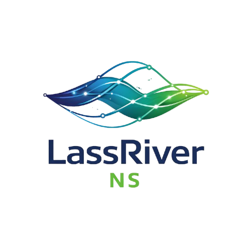

<!--
README for GitHub Organization / Repository
Org: LassRiver-NS-A2026EDW
-->

  

<h1 align="center">LassRiver-NS-A2026EDW</h1>

  <strong>Scalable AI • Neural Networks • Big Data Platforms</strong> 
  Owner-driven engineering delivering end-to-end systems in security, education, and automation.

  <a href="#core-projects">Core Projects</a> •
  <a href="#technology-stack">Technology Stack</a> •
  <a href="#engineering-approach">Engineering Approach</a>

## Overview

**LassRiver-NS-A2026EDW** is a technology organization focused on building **scalable AI, neural network, and data-intensive platforms**.  
We design and deliver end-to-end systems that combine **machine learning**, **modern web experiences**, and **robust backend architectures** to solve real-world problems.

Our owners are hands-on developers responsible for the full lifecycle—from **architecture and implementation** to **deployment and reliability**.

---

## Core Projects

### 1) Insurgent Activity Detection with Neural Networks
An AI-driven system designed to detect and analyze potential insurgent activities using **neural networks** and **large-scale data processing**.  
The platform supports early detection through **pattern recognition**, **anomaly detection**, and **risk-based insights**.

**Highlights**
- Neural network models for behavioral & pattern signals  
- Scalable ingestion and processing pipelines  
- Predictive analytics and alerting-ready outputs  

---

### 2) Agile Reading Skills Development Platform
A learning platform that helps users build **fast, efficient, and accurate reading skills** through structured practice and data-driven feedback.  
It adapts content based on performance and tracks progress with measurable indicators.

**Highlights**
- Adaptive learning flows and progress tracking  
- Performance analytics and personalized exercises  
- Designed for consistent improvement over time  

---

### 3) AI Landing Page Builder with Automated Deployment
A platform that generates landing pages using AI and ships them to production with **automated deployment**.  
It reduces time-to-market by streamlining content generation, layout creation, and delivery pipelines.

**Highlights**
- AI-assisted content and layout generation  
- Automated build + deploy pipeline  
- Scalable delivery-ready architecture  

---

### 4) Specialized Learning Platform for Saber PRO Preparation
An education platform built to support learners preparing for **Saber PRO** exams.  
It provides competency-based learning paths, evaluation tools, and analytics to reinforce targeted skills.

**Highlights**
- Exam-aligned learning paths and diagnostics  
- Competency tracking and performance insights  
- Focused content for specialized preparation  

---

## Technology Stack

  <b>Frontend:</b> Next.js 
  <b>Backend:</b> ASP.NET Core 
  <b>AI / Data:</b> Neural Networks, Data Pipelines, Analytics Systems

---

## Engineering Approach

We build with a long-term mindset:
- **Clean architecture** over quick hacks  
- **Scalability and performance** as first-class requirements  
- **Security and reliability** baked into design  
- **Maintainability** through consistent standards and strong ownership  

---

  © LassRiver-NS-A2026EDW — Built by owner-developers, engineered for scale.

